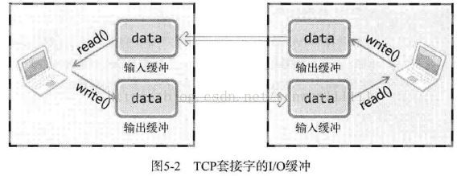
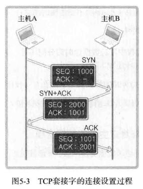
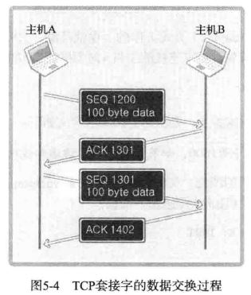
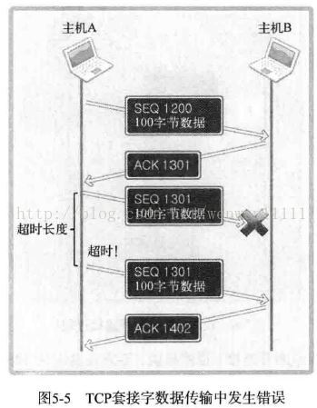
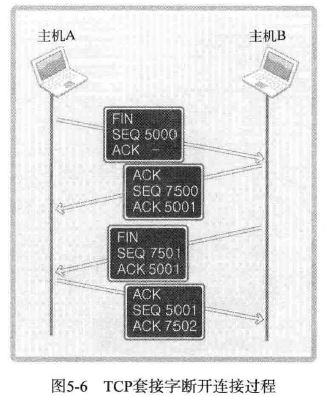

# 简述 TCP 原理

> 前言：网络编程！根据书上的内容简述 TCP 原理

## TCP 套接字的 IO 缓冲

write 和 read 都不是直接传输数据，而是在调用的瞬间从缓冲里面读或者写入数据。**而由于 TCP 的滑动窗口机制，不会使得发送的数据大于缓冲的大小**

## TCP 套接字的连接——三次握手

什么是 SYN 包，也就是 TCP 报文里面有一个 FLAG 标志位，里面有一个 bit 位标识了这个包是 SYN 包。表示**建立连接**的意思

FLAG 其他的 bit 表示其他不同的含义：

- ACK：确认序号有效
- RST：重置连接
- FIN：释放一个连接
- PSH：不缓存的收发数据
- URG：紧急传送（现代协议不常用）

## TCP 套接字之间的数据传输

ACK = SEQ + len(Data) + 1

如果丢包，重发

## TCP 套接字的断开

