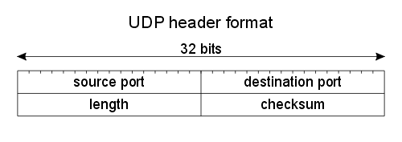

# 简述 UDP

> 前言：网络编程，简述 UDP

## 0x00 UDP 的特点

### UDP 包的头

UDP 包的头很简单，如图所示，只有四个部分。甚至没有 seq number。如果 UDP 的包被分片了，只要有一个分片了的包丢掉了，整个 UDP 的包就丢了！

### UDP客户端套接字的地址分配

udp 程序中，调用 sendto() 函数传输数据前完成**套接字地址的**分配工作，可以调用 bind 函数，bind 函数不区分 TCP 还是 UDP。

如果调用 sendto 函数时，发现没有分配地址，则**首次调用 sendto 时自动分配 IP 和端口，并且分配的地址移植保留到程序结束**

### UDP 存在数据边界

与 TCP 不一样，UDP 协议中，调用IO函数的次数很重要，**输入函数的调用次数和输出函数的调用次数完全一致，才能保证接收完全**。

## 0X01 UDP 例子

详见相同目录的例子 host1.c 和 host2.c

