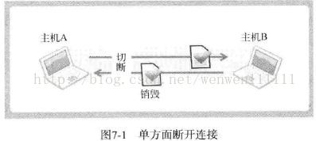

# 优雅断开套接字


> 前言：优雅断开套接字


## 0X00 为什么要优雅断开套接字





在之前的例子中，我们都是用 close 直接关闭套接字。但是这样有一个弊端，就是不能接受来自另一端的消息了。


如图中所示：


假如 A，close 了套接字，**实际上是完全无法调用与接收数据相关的函数**。


## 0X01 如何优雅断开套接字


用 shutdown() 关闭套接字！


如图所示，其实一共维护了两个 I/O 流。我们的本意是，不再向另一端发送数据。所以只关闭一个流就可以了！


```c
int shutdown(int sock, int howto);  
```


sock：需要断开的套接字文件描述符  

howto：断开方式  （SHUT_RD：断开输入流  SHUT_WR：断开输出流  SHUT_RDWR：同时断开IO流）


## 0X02 例子


详见相同目录下的 `file_client.c` `file_server.c` `file_ssrv.c`


 

