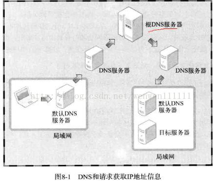
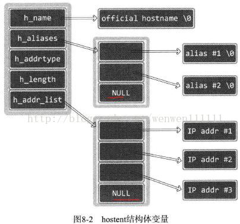

# 域名及网络地址


> 前言：这一章主要学习两个 API，以及一个结构体


## 0X00 简单介绍 DNS


 DNS（Domain Name System）是对 IP 地址和域名进行相互转换的系统，核心是 DNS 服务器。所有计算机都记录着默认 DNS 服务器地址，通过这个 DNS 服务器得到相应域名的 IP 地址信息。一般服务器域名不会轻易改变，但会相对频繁地改变服务器 IP 地址。可以通过 ping  www.baidu.com 查看对应的 IP 地址


也可以通过 nslookup 命令查看计算机中注册的默认 DNS 服务器地址。


计算机内置的默认 DNS 服务器并不知道网络中的所有域名 IP 地址，若本地不知道，则会询问其他 DNS 服务器


如图所示：





## 0X01 重要的 API 以及数据结构


```c
struct hostent * gethostbyname(const char * hostname);  

struct hostent{  
  char * h_name;  //official name 官方域名  
  char ** h_aliases; //alias list，除了官方域名以外的其他域名  
  int h_addrtype; //host address type  
  int h_length; //address length  
  char ** h_addr_list //address list  域名对应的ip列表
  //如果一个域名所对应的服务器需要多个服务器进行负载均衡，就可以一个域名对应多个ip
}  
```





## 0X02 例子


详情见相同目录下的：`getHostByName.c` 和 `getHostByAddr.c`


