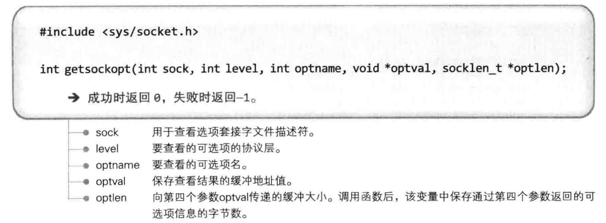
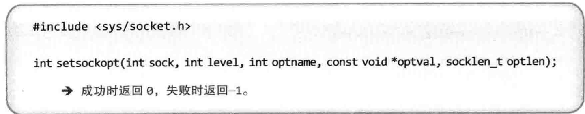
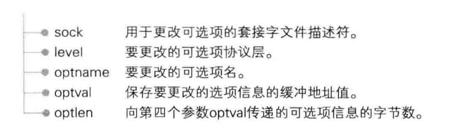
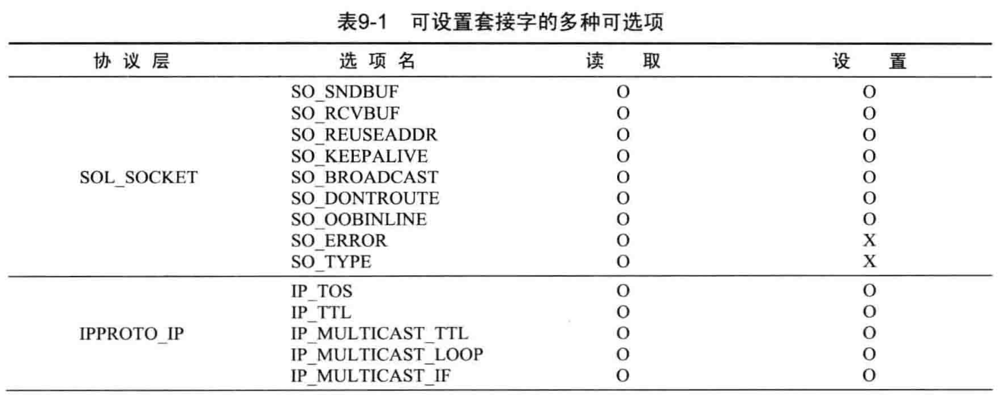
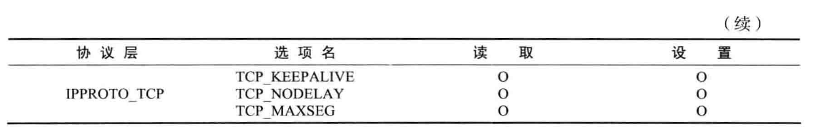
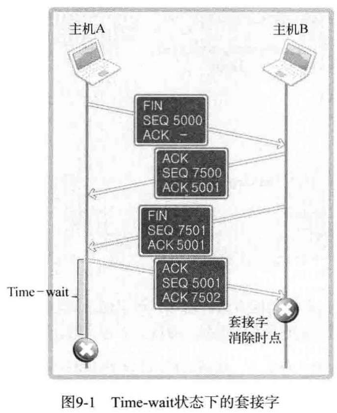
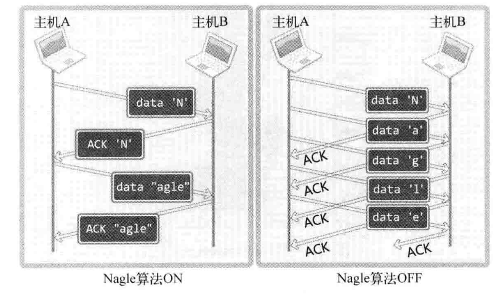

# 简述套接字的多种选项


> 前言：得到套接字的设置以及设置套接字


## 0X00 两个重要的 API


我们之前写的程序是创建好套接字以后，未经特别操作直接使用的，此时通过默认的套接字特性进行通信。


可用 setsockopt() 设置 socket 以及 getsockopt() 得到 sock 的设置











其中的 level 和 optname 就是这个：








level 就是协议层，选项名就是 optname，当然还有很多。。。


## 0X01 例子


+ 得到 socket 的类型

  见相同目录下的 sock_type.c


+ 设置套接字缓冲

  见 socket_buf.c


+ 设置 time wait


什么是 time wait 状态：





由于 time wait 的存在，在给服务器 Ctrl c 的时候，服务端不能立刻重新监听端口。以至于不能重新启动服务端，所以我们可以设置不启用 time wait，代码如下：


```c
optlen = sizeof(option);
option = TRUE;
setsocket(serv_sock, SOL_SOCKET, SO_REUSEADDR, &option, optlen);
```


+ Nagle 算法





由于 Nagle 算法在开启的时候，是在等待 ACK 到了才发数据。所以正常情况下，使用 Nagle 算法比不使用**速度要慢**


但是在传输大数据的时候，也会把缓存装满，所以也就没有必要开启 Naggle 算法。


禁用代码如下：


```c
int opt_val = 1;
setsockopt(sock, IPPROTO_TCP, TCP_NODELAY,  (void *)&opt_val, sizeof(opt_val));
```


