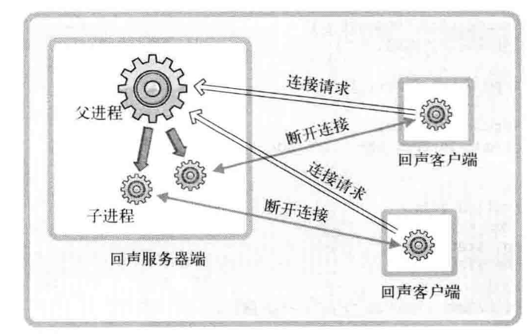

# 并发服务器


> 前言：实现多进程服务器


实现并发服务器的方法有：


+ 多进程服务器
+ 多路复用服务器
+ 多线程服务器


这一章主要讲的是「多进程服务器」


## 0X00 创建进程


使用 fork() 创建进程，如果是父进程调用这个函数，能够得到这个进程的 pid，如果是子进程执行这个函数会得到 0。


## 0X01 用信号的方法消灭僵尸进程


### 产生僵尸进程的原因


子进程的有两种终止方式：


+ 传递参数并调用 exit
+ main 函数中执行 return 语句并返回值


但是这样都会回到操作系统，而操作系统不会主动销毁子进程。所以就会产生「僵尸进程」。


### 用信号的方法消灭僵尸进程


这一章还介绍了其他方法，但是最好的方法还是用「信号」！


由于，子进程返回以后会回到操作系统。操作系统可以把子进程终止的消息，告诉父进程。只要提前定义了**杀掉子进程的程序**就能消灭僵尸进程


注册信号我们可以使用：


而 sigaction 的结构如下：


```c
struct sigaction {
    void (*sa_handler)(int);
    sigset_t sa_mask;
    int sa_flags
}
```


**此结构体中的 sa_handler 保存信号处理的函数值，由于只处理僵尸进程，所以用 sigemptyset 设置 sa_mask 为 0，就好了！**


具体例子见相同目录下的：`sigaction.c`


## 0X02 基于进程的并发服务器模型


模型如下：





详见相同目录下的：


由于调用 fork 的时候，会复制所有父进程的所有内容，也会复制文件描述符，所以会有多个文件描述符，对应同一个套接字。


也就是这样：


为了正常关闭套接字，要将无关的套接字文件描述符关掉。也就是：


具体代码见相同目录下的：`mpehco_server.c` 和 `splitecho_client.c`


