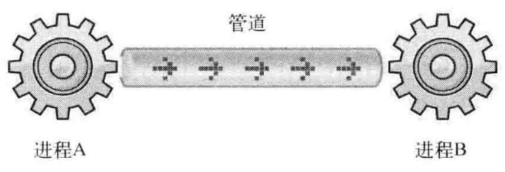
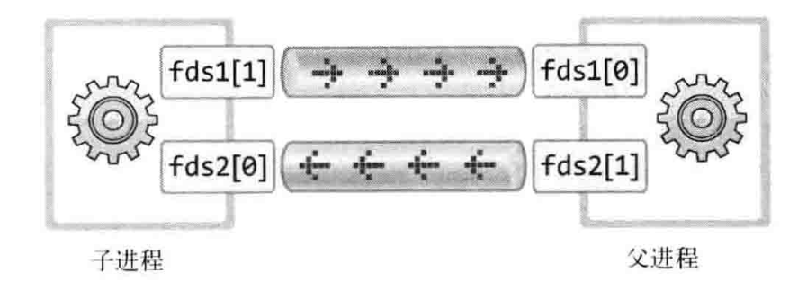

# 简述进程间通信


> 前言：进程间通信


## 0X00 管道间通信原理


原理如图所示：




使用如下的语法创建这样的管道：

```c
int pipe(int fds[2]);
```


管道有如下的特点：


+ 管道是半双工的，数据只能向一个方向流动；需要双方通信时，需要建立起两个管道；
+ 只能用于父子进程或者兄弟进程之间（具有亲缘关系的进程）；
+ 单独构成一种独立的文件系统：管道对于管道两端的进程而言，就是一个文件，但它不是普通的文件，它不属于某种文件系统，而是自立门户，单独构成一种文件系统，并且只存在与内存中；
+ 数据的读出和写入：一个进程向管道中写的内容被管道另一端的进程读出。**写入的内容每次都添加在管道缓冲区的末尾，并且每次都是从缓冲的头部读出数据**。


## 0X01 利用管道进行双向通信


详见相同目录下的 `pipe.c`





