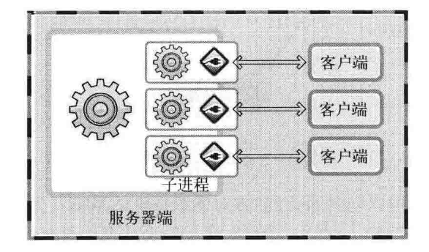
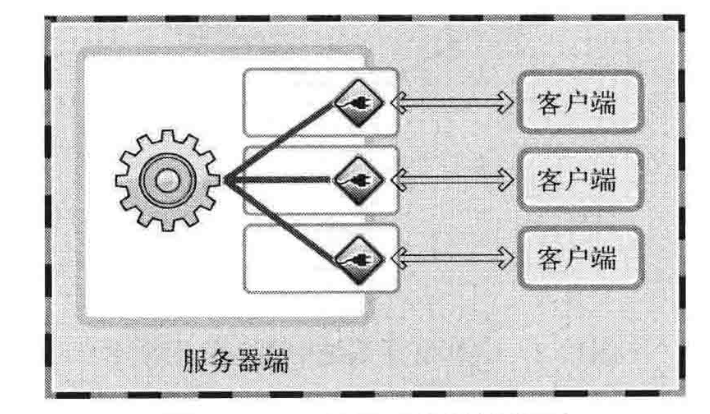

# IO 复用服务器模型


> 前言：简述 IO 复用服务器模型


## 0X00 简述 IO 复用服务器原理


之前我们实现过多进程的服务器，创建子进程处理客户端的请求。




现在我们可以这样：





这个叫做 IO 复用。在这一章中实现 IO 复用的关键就是 select 函数！


## 0X01 简述 select 函数的作用


```c
int select(int n, fd_set *readfds, fd_set *writefds, fd_set *exceptfds,
           struct timeval *timeout);

FD_SET(int fd, fd_set *set);
FD_CLR(int fd, fd_set *set);
FD_ISSET(int fd, fd_set *set);
FD_ZERO(fd_set *set);

struct timeval {
    long tv_sec;
    long tv_usec;
}
```


## 0X02  用 select 实现 IO 复用服务器


